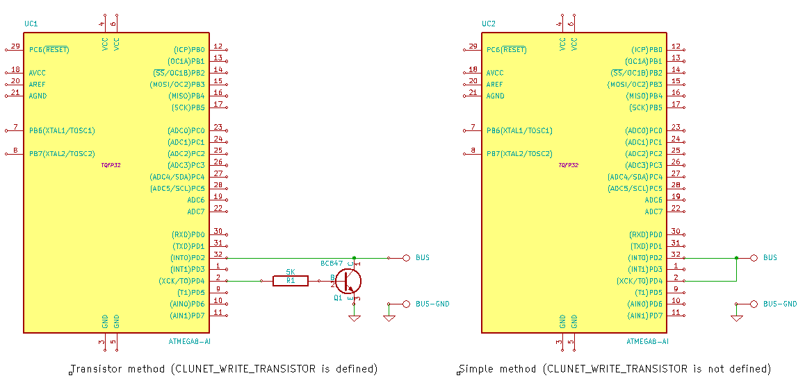

# CLUNET

The CLUNET library allows building a simple single-wire peer-to-peer network on AVR microcontrollers. It is a perfect way to interconnect microcontrollers in your house.

Features:

* Requires only a few cheap additional components;
* Using only a single wire;
* Using only two pins;
* There is no master device, all devices are equal;
* You can use a very long cable, more than 100 meters;
* You don't need to care about collisions;
* Automatic CRC calculation and CRC check;
* Pseudo multitasking using interrupts;
* Up to 255 devices on one bus.

## How to use

### Hardware part

You need a pin with an external interrupt to read data and any other pin to send data. Transistor method is recommended. 

### Software part

You will need one free 8-bit timer with `output compare match` and `overflow` interrupts.

#### Configuration####

Edit *clunet\_config.h* and change some values:

* **CLUNET\_DEVICE\_ID** - address of the device (0-254);
* **CLUNET\_DEVICE\_NAME** - name of the device (optional);
* **CLUNET\_SEND\_BUFFER\_SIZE** - send buffer size and maximum output packet size (memory usage);
* **CLUNET\_READ\_BUFFER\_SIZE** - read buffer size and maximum input packet size (memory usage);
* **CLUNET\_WRITE\_PORT** and **CLUNET\_WRITE\_PIN** - port and pin to send data;
* **CLUNET\_READ\_PORT** and **CLUNET\_READ\_PIN** - port and pin to read data, should be connected directly to the line;
* **CLUNET\_WRITE\_TRANSISTOR** - define if you are using a transistor on output pin (see schematics);
* **CLUNET\_TIMER\_PRESCALER** - prescaler for timer, define it to autocalculate `CLUNET_T` value as `64us`, it *must* match timer initialization code, `(F_CPU / CLUNET_TIMER_PRESCALER) / 15625` *must* be >= 8 and <= 24, thus 64 is the optimal value for 8MHz;
* **CLUNET\_T** - T value, it's a time period between signals in timer ticks, length of logical 0 is T, and logical 1 is 3\*T, lower T is faster while higher T is more stable, it's autocalculated as 64us based on **CLUNET\_TIMER\_PRESCALER** if not defined;
* **CLUNET\_TIMER\_INIT** - code to init timer (normal mode);
* **CLUNET\_TIMER\_REG** - timer/counter register;
* **CLUNET\_TIMER\_REG\_OCR** - timer/counter `output compare` register;
* **CLUNET\_ENABLE\_TIMER\_COMP** and **CLUNET\_DISABLE\_TIMER\_COMP** - code to enable/disable timer `output compare match` interrupt;
* **CLUNET\_ENABLE\_TIMER\_OVF** and **CLUNET\_DISABLE\_TIMER\_OVF** - code to enable/disable timer `overflow` interrupt;
* **CLUNET\_INIT\_INT** - code to init external interrupt (read pin);
* **CLUNET\_TIMER\_COMP\_VECTOR** - timer `output compare match` interrupt vector;
* **CLUNET\_TIMER\_OVF\_VECTOR** - timer `overflow` interrupt vector`;
* **CLUNET\_INT\_VECTOR** - `external interrupt` vector.

Default configuration file is optimised for ATMEGA8 / 8MHz.

#### Code

Include "clunet.h" and create callback function to receive data:

    #include "clunet.h"
    
    void data_received(unsigned char src_address, unsigned char dst_address, unsigned char command, char* data, unsigned char size)
    {
    	/* your code here */
    }

Add initialization code and enable interrupts:

    int main (void)
    {
    	clunet_init();
    	clunet_set_on_data_received(data_received);	
    	sei();

Also you can use `clunet_set_on_data_received_sniff()` to set callback function which will receive all packets, not only for this device.

Function to send data:

	void clunet_send(unsigned char address, unsigned char prio, unsigned char command, char* data, unsigned char size);

* **address** - address of destination device or `CLUNET_BROADCAST_ADDRESS` for multicast
* **prio** - packet priority:
  1. `CLUNET_PRIORITY_NOTICE`,
  2. `CLUNET_PRIORITY_INFO`,
  3. `CLUNET_PRIORITY_MESSAGE`,
  4. `CLUNET_PRIORITY_COMMAND`;
* **command** - command ID (0-255), note that some IDs are occupied by predefined commands (see *clunet.h*) and some are reserved (see below);
* **data** - pointer to data if any;
* **size** - data size.

Sample code:

	char buffer[1];
	buffer[0] = 1;
	clunet_send(CLUNET_BROADCAST_ADDRESS, CLUNET_PRIORITY_MESSAGE, CLUNET_COMMAND_DEVICE_POWER_INFO, buffer, sizeof(buffer));
	
	while (clunet_ready_to_send()); // wait while sending, otherwise next call will replace output buffer
	                                // clunet_ready_to_send() returns current task priority
	                                // or 0 if output buffer is not busy

	char *hello = "Hello world!";
	clunet_send(1, CLUNET_PRIORITY_INFO, 100, hello, strlen(hello));

#### Reserved commands

There are some reserved commands:

* **CLUNET\_COMMAND\_DISCOVERY** (0x00) - send this command as broadcast packet to find all devices in your network, devices will answer with command **CLUNET\_COMMAND\_DISCOVERY\_RESPONSE** (0x01) and **CLUNET\_DEVICE\_NAME** in data section;
* **CLUNET\_COMMAND\_REBOOT** (0x02) - send this command to reboot a device;
* **CLUNET\_COMMAND\_BOOT\_CONTROL** - (0x03) reserved for bootloader and firmware update;
* **CLUNET\_COMMAND\_BOOT\_COMPLETED** (0x04) - sent by device on start (call of `clunet_init()`), data is value of *MCUCSR* register, so your can determine reset source;
* **CLUNET\_COMMAND\_PING** (0xFE) - ping, you can test line using this command, device(s) will answer with **CLUNET\_COMMAND\_PING\_REPLY** (0xFF) and same data.

## Tested on

* ATMEGA8;
* ATMEGA16;
* ATMEGA64.

## Known bugs/problems

* Any data on bus will slow down every connected device a little.
* No delivery check, you can make it in your application code if necessary.

## Author/contacts

**Alexey 'Cluster' Avdyukhin**

clusterrr@clusterrr.com

[https://github.com/ClusterM](https://github.com/ClusterM "https://github.com/ClusterM")

[http://clusterrr.com](http://clusterrr.com "http://clusterrr.com")
